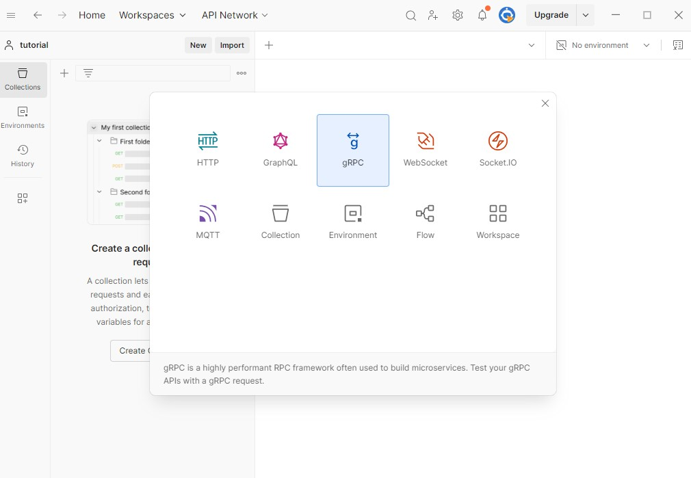
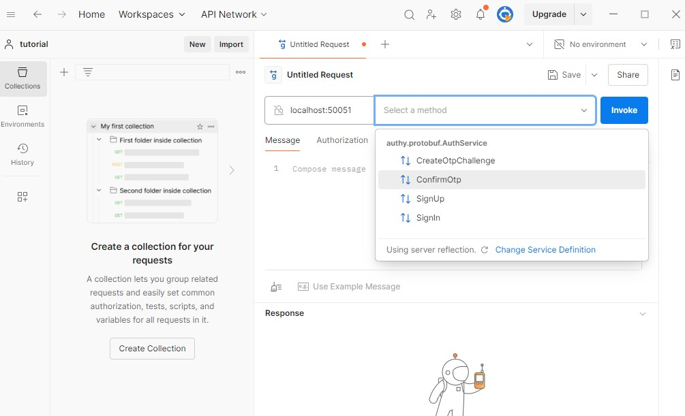

# Part 3: Compiling the Protos and Setting up the gRPC server

## Overview

In the previous part, we defined our gRPC service interface using Protocol Buffers. In this part, we'll compile the proto file to generate the service stubs and message types and also use the service reflection to make it easy to testing the service from the postman.

If you don't know about the postman, it is a popular API client that allows you to test APIs by sending requests and viewing responses. You can download it from [here](https://www.postman.com/downloads/). Developers use Postman to test APIs, document APIs, monitor APIs, and share APIs with others. we can also use it to test our gRPC service.

## Table of Contents

- [Compiling the Protobuf](#compiling-the-protobuf)
  - [Creating the build script](#creating-the-build-script)
  - [Installing the protoc compiler](#installing-the-protoc-compiler)
- [Integrate compiled gRPC stubs](#integrate-compiled-grpc-stubs)
- [Setup the server](#setup-the-server)
- [Conclusion](#conclusion)

## Compiling the Protobuf

In rust we can write build scripts that are executed before the build process. We can use this to compile the proto file and generate the service stubs and message types. We will use the `tonic-build` crate to compile the proto file.

In the previous part, we created the `proto_stub` crate. Now we are going to work on this crate to compile the proto file. First, make sure to add the `tonic-build` crate to the `build-dependencies` section of the `Cargo.toml` file in the `proto_stub` crate.

`file-path: proto_stub/Cargo.toml`

```toml
[package]
    ...

[dependencies]
tonic.workspace = true
prost-types.workspace = true
prost.workspace = true

[build-dependencies]
tonic-build.workspace = true

```

In dependencies section, we added the tonic, prost-types, and prost crates and foreach crate we set the `workspace` flag to `true`. This flag is used to tell the cargo that the crate is a workspace crate and its version is defined in the workspace `Cargo.toml` file. Similarly We also added the `tonic-build` crate to the `build-dependencies` section.

`tonic` : The tonic crate is a gRPC library for Rust. It provides a client and server implementation for gRPC services. The tonic crate is built on top of the tokio crate, which is an asynchronous runtime for Rust.

`prost-types` : The prost-types crate provides the well-known types for the prost crate. The well-known types are the types defined by the protobuf standard. The prost crate is a Rust implementation of the Protocol Buffers serialization format.

`prost` : The prost crate is a Rust implementation of the Protocol Buffers serialization format. The prost crate is used to generate Rust code from the Protocol Buffers definitions.

### Creating the build script

Now we need to create a build script to compile the proto file. Create a new file named `build.rs` in the `proto_stub` crate and add the following code to the file.

`file-path: proto_stub/build.rs`

```rust
use std::{error::Error, path::PathBuf};

fn main() -> Result<(), Box<dyn Error>> {
    let out_dir = PathBuf::from(std::env::var("OUT_DIR")?);

    tonic_build::configure()
        // compile_well_known_types will generate code for well known types like google.protobuf.Empty  
        // we can disable this if we use the prost-types crate, because i am using prost-types crate i will kept this disabled.
        // compile_well_known_types(true) 

        // file_descriptor_set_path will generate a file descriptor set in the output directory
        // this file will be used by the server to provide reflection
        .file_descriptor_set_path(out_dir.join("my_descriptor.bin"))
        .compile_protos(
            // the path to the main proto file to compile
            &["proto/authy/protobuf/main.proto"], 
            // the path to the directory containing the proto files dependencies
            // protobuf compiler will look for dependencies in this directory
            &["proto/authy/protobuf"], 
        )?;

    Ok(())
}

```

In the build script, we first get the output directory path using the `std::env::var("OUT_DIR")?` function. The output directory is where the generated code will be placed.

Next, we call the `tonic_build::configure()` function to configure the build process. We can pass various options to the `configure()` function to customize the build process. In this case, we are using the `file_descriptor_set_path()` function to generate a file descriptor set in the output directory. The file descriptor set is used by the server to provide reflection.

Finally, we call the `compile_protos()` function to compile the proto file. The `compile_protos()` function takes two arguments: the path to the main proto file to compile and the path to the directory containing the proto file dependencies.

### Installing the protoc compiler

Now if you run the `cargo build -p proto_stub` command in the terminal, you will see build errors because we don't have the protoc compiler installed. We need to install the protoc compiler to compile the proto file.

In windows, you can install the protoc compiler by using chocolatey package manager. Run the following command in the terminal to install the protoc compiler.

```powershell
choco install protoc
```

In linux, you can install the protoc compiler by running the `sudo apt install protobuf-compiler` command in the terminal. In mac, you can install the protoc compiler by running the `brew install protobuf` command in the terminal.

You can also download the protoc compiler from the [official protobuf release page](https://github.com/protocolbuffers/protobuf/releases/tag/v29.1) and add the path to the protoc compiler to the system environment variable.

After installing the protoc compiler, check the protoc compiler version by running the `protoc --version` command in the terminal. If the protoc compiler is installed correctly, you will see the protoc compiler version.

Now run the `cargo build -p proto_stub` command in the terminal. It will run the build script and compile the proto file to generate the service stubs and message types. And then build the `proto_stub` crate.

If the build is successful, you will see the generated code in the output target directory.
Because we are using cargo workspaces, the generated code will be placed in the target directory of the workspace root.

run this powershell command to find the generated code in the target directory.

```powershell
Get-ChildItem -Path . -Recurse -Filter authy.protobuf.rs
```

## Integrate compiled gRPC stubs

Now we have the generated service stubs and message types in the output target directory.
Edit the `lib.rs` file as shown below to include the generated code.

`file-path: proto_stub/src/lib.rs`

```rust

// we have to define the namespace exactly as the proto file package name 
// in this case the package name is authy.protobuf so we have to define the namespace as authy::protobuf.

pub mod authy {
    pub mod protobuf {
        // include the generated code authy.protobuf.rs
        tonic::include_proto!("authy.protobuf");
        const FILE_DESCRIPTOR_SET : &[u8]= tonic::include_file_descriptor_set!("my_descriptor");
    }
}
```

In the code above, we define the namespace exactly as the proto file package name. In this case, the package name is `authy.protobuf`, so we define the namespace as `authy::protobuf`.

## Setup the server

In authy crate, we will edit the main.rs module to setup the server and expose the service.
First add the following dependencies to the `Cargo.toml` file in the `authy` crate.

`file-path: authy/Cargo.toml`

```toml
[dependencies]
tokio.workspace = true 
tonic.workspace = true
tonic-reflection.workspace = true
serde.workspace = true
```

We need tonic::transport::Server::builder() to build the server and a service address to bind the server to a specific address. As service address we will use `0.0.0.0:50051`. where `0.0.0.0` is the IP address of the server and `50051` is the port number.

`file-path: authy/src/main.rs`

```rust
// File descriptor set generated by the build script
use proto_stub::authy::protobuf::FILE_DESCRIPTOR_SET;

use std::{error::Error, net::SocketAddr};
use tonic::transport::Server;

// We use the #[tokio::main] attribute to define the main function as an asynchronous function. This allows us to use the tokio runtime to run asynchronous code.
#[tokio::main]
async fn main() -> Result<(), Box<dyn Error>> {
    // Parse the address from the address string
    let addr: SocketAddr = "0.0.0.0:50051".parse().unwrap();

    /*
    parse() on address string works because the SocketAddr type implements the FromStr trait. The parse() method is used to parse a string into a SocketAddr type and unwrap() is used to get the value from the Result type.
    */

    // Print message to the console
    println!("Running server on {addr}");

    /*
    We create a new server instance using the Server::builder() method. We then add a service to the server using the add_service() method. We configure the reflection service using the tonic_reflection::server::Builder::configure() method.

    We register the encoded file descriptor set using the register_encoded_file_descriptor_set() method. Finally, we build the server using the build_v1alpha() method and serve it on the specified address using the serve() method. We use the await keyword to wait for the server to start serving requests.
    */
    Server::builder()
        .add_service(
            tonic_reflection::server::Builder::configure()
                .register_encoded_file_descriptor_set(FILE_DESCRIPTOR_SET)
                .build_v1alpha()?,
        )
        .serve(addr)
        .await?;

    Ok(())
}
```

Now open the terminal and run the `cargo run -p authy` command. It will start the server and print the message `Running server on 50051` to the console.

You can use the postman to test the reflection service. Open the postman and click on new and and select the gRPC request type as shown in the image below.



In the request URL, enter the server address `grpc:\\localhost:50051`.
Now click on the next text box and select the Use Server Reflection in the popup menu and you will see the available services and methods in the server as shown in the image below.



If you are seeing the available services and methods in the server, then the reflection service is working correctly.

You can select one of the services and methods and send a request to the server to test the service it will return the unimplemented error because we haven't implemented the service yet.

Other tools like BloomRPC, grpcurl, grpcui, grpc-web, etc. can also be used to test the gRPC service. You can use any of these tools to test the gRPC service. But these tools are not in the scope of this series.

## Conclusion

In this part, we compiled the proto file to generate the service stubs and message types. We also used the service reflection to make it easy to test the service from postman. In the next part, we will implement the service and client to authenticate the user using the gRPC service.
